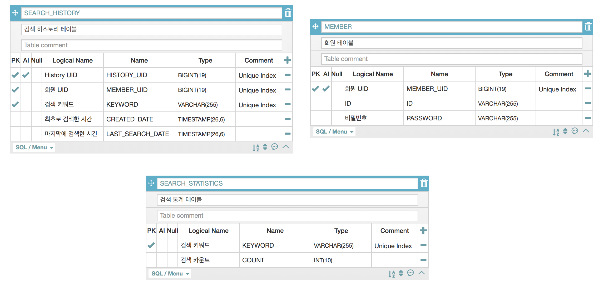

# 실행 명령어
> java -jar -Dspring.profiles.active=local chicken-release.jar

# 초기 로그인 계정
1. chicken // leg
2. swagger // swagger
3. tester // tester
4. zip // zip

# 빌드 방법
>./gradlew clean build

빌드 명령어 수행 시, Back-end와 Front-end 를 동시에 빌드, 배포할 수 있도록 하였습니다. (gradle.build 파일 참고)

# 개발환경
|                 |내용                            |   비고 |
|----------------|-------------------------------|--------|
|개발 언어  |java 1.8.0_151             |  -  |
|Backend 사용 기술  | Springboot 2.1.6  |  -  |
|  | Spring security| 로그인/로그아웃 처리 및 비밀번호 암호화를 위해 사용하였습니다.
|  |  Swagger2|RestAPI 문서 명세 및 테스트를 위해 사용하였습니다.  | 
Frontend 사용 기술 | React  | SPA 구현을 위해 사용하였습니다.
|  |  부트스트랩|  UI작업을 위해 사용하였습니다.  |

# 테이블 명세

# Membory DB 접속 콘솔
> localhost:8080/h2

여러가지 이유로 DB의 데이터를 확인할 필요가 있을 때 접속하면 됩니다.

DB 계정   : chicken // leg

JDBC URL : jdbc:h2:mem:memory_db

# Swagger 주소
>localhost:8080/swagger-ui.html

Swagger에서 최초로 API 요청 시 로그인페이지로 접근되는 문제 때문에, 부득이하게 Swagger를 접속할 때에도 로그인이 필요합니다.

# release 파일 다운로드 주소 
프로젝트 폴더의 build-release 폴더 내에 jar파일이 있습니다.

# 한계
- (Front-end) React의 안티패턴일 수 있는 각 컴포넌트마다 State를 가지는 구조가 되었습니다. 
- (Back-end) 통계 관련 처리 시, HISTORY 테이블에서 Query로 집계하는 것이 아니라 통계 테이블을 구성했기 때문에 카운트가 안맞을 가능성이 있어 보입니다. 히스토리 테이블과 통계 테이블의 Sync를 맞추기 위해 애플리케이션단에서 트랜잭션 처리 혹은 특정 주기 단위로 배치처리를 하여 카운트 보정작업이 필요할 것 같습니다.

# 특이사항
- MacOS에서 jar를 띄워서 동작을 확인하면 정상적이나, Windows에서 확인 시 한글이 깨지는 현상이 있으므로 MacOS에서 확인, 혹은 상단에 말씀드린 H2 웹 콘솔로 데이터를 확인해주시면 될 것 같습니다.

# 연락처
- inpyo.developer@gmail.com